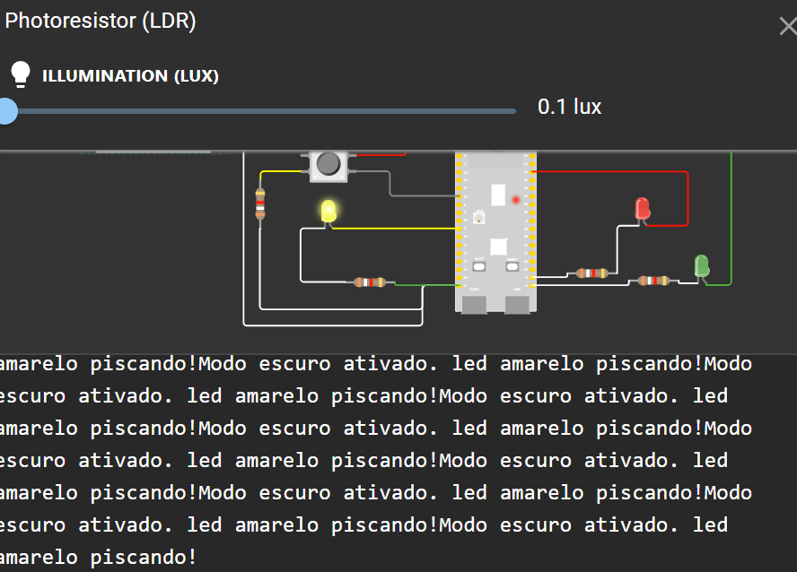
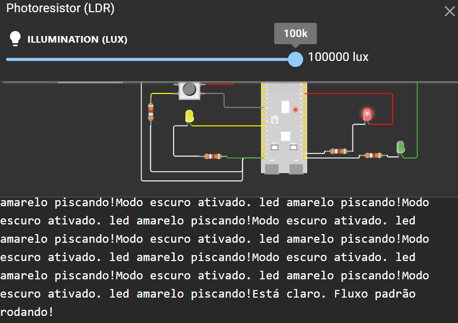

o prototipo possui dois estados:

- modo noturno (led amarelo pisca a cada segundo)
- fluxo padrão (temporização alternando entre ativação do verde (3 segundos), amarelo (2 segundos) e vermelho (5 segundos)

abaixo prints do modo noturno:

nessa imagem o ldr esta captando um valor considerado escuro e por conta disso o led amarelo esta aceso, e ira apagar apos 1 segundo como definido, e irá ficar assim até que o LDR detcte um valor considerado claro

e do modo convencional:

agora o LDR esta captando um valor considerado claro e o fluxo corre normalmente como definido (alternando entre ativação do verde (3 segundos), amarelo (2 segundos) e vermelho (5 segundos)), nesse caso o led vermelho esta aceso, apos o tempo definido ele ira apagar e o led verde ira acender e depois o amarelo e assim o fluxo corre até um valor escuro ser detctado e o modo noturno ser ativado

o serial monitor tambem informa oque esta acontecendo via texto

é possivel acompanhar o prototipo pelo simulador atraves deste link: https://wokwi.com/projects/417166475177227265
